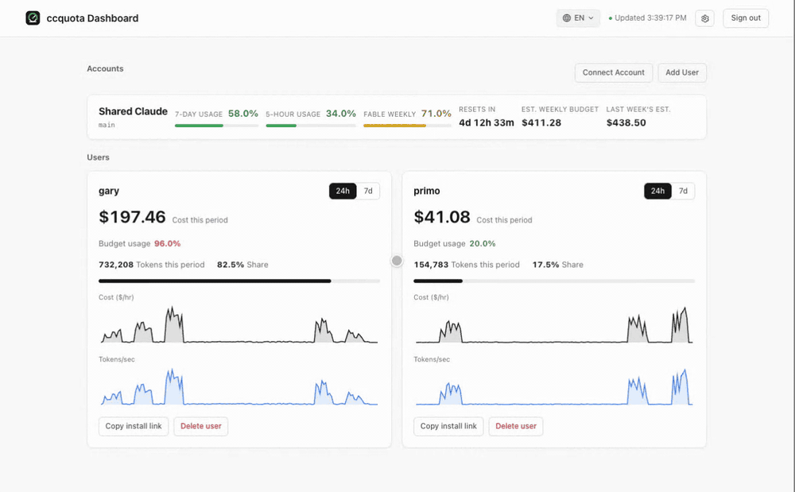
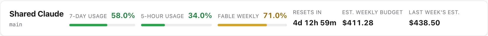
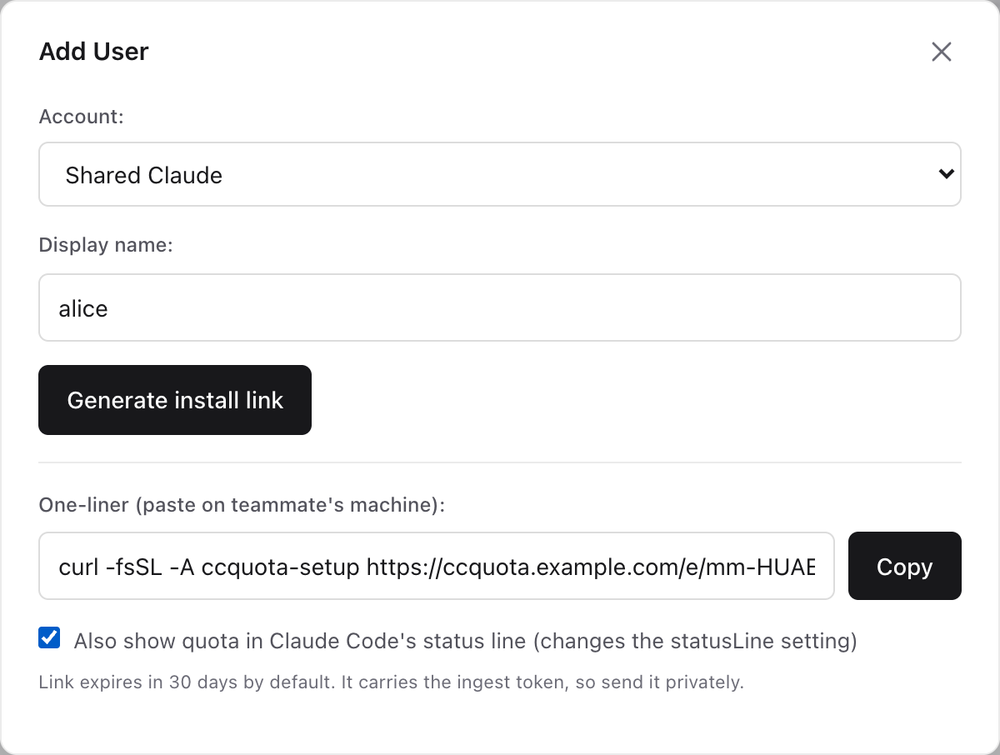
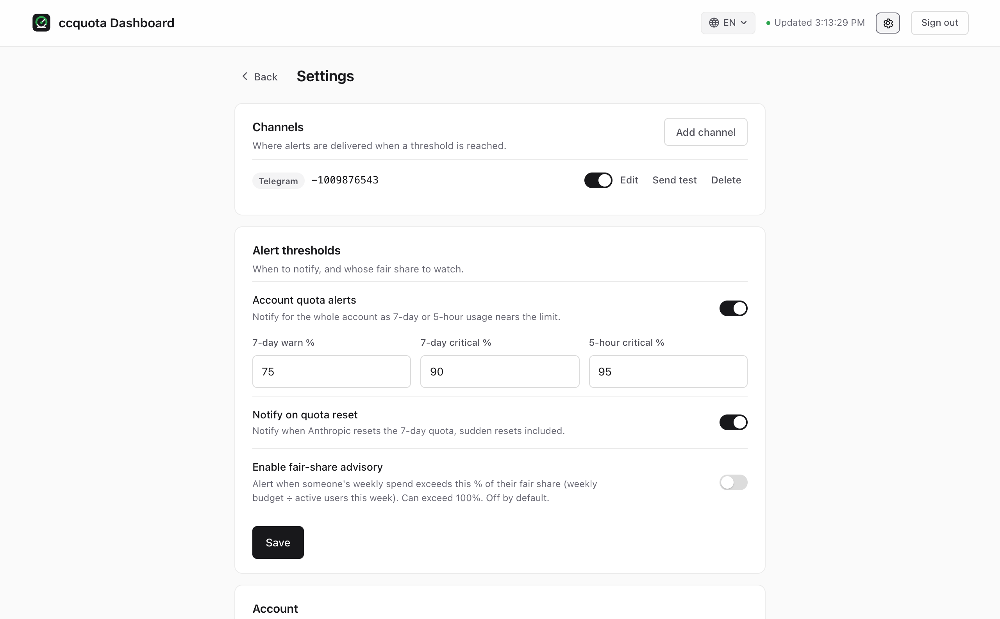

<div align="center">


Self-hosted quota monitor for shared Claude accounts. One Go binary, built-in web UI.

[](https://github.com/homieyangg/ccquota/releases)
[](https://github.com/homieyangg/ccquota/actions/workflows/ci.yml)
[](LICENSE)

**English** · [繁體中文](README.zh-TW.md) · [简体中文](README.zh-CN.md)

</div>



ccquota polls Claude's official OAuth usage endpoint and shows how close a shared account is to its 7-day, 5-hour and model-scoped weekly limits, across multiple accounts. It flags Anthropic's sudden resets, and (optionally) tracks each person's spend, reverse-calculates the weekly budget, and splits it per user.

## Features

- **Live 7d / 5h usage** straight from the OAuth usage endpoint, not guessed from logs.
- **Model-scoped weekly limit**, such as the Fable weekly cap, which is often hit before the overall 7-day limit.
- **Multiple accounts**, each polled on its own schedule.
- **Per-user cards** with cost and token-rate charts (24h / 7d), hover for exact values.
- **Reverse-calculated weekly budget**, split across the people on the account.
- **Sudden-reset detection** when Anthropic zeroes a window early.
- **Notifications** to Telegram or a webhook, with thresholds you set in the UI. Bot tokens are encrypted at rest.
- **No web OAuth needed**: paste a code in the browser, or import an existing `claude login` token.
- **Keeps reading after the login expires**: set a one-year token as a fallback and skip the re-login every four weeks.
- One static binary, embedded UI, SQLite. No external services.

## Quick start

Install the server on one machine. Each teammate then runs a single command on their own computer.

### Linux, macOS

```bash
curl -fsSL https://raw.githubusercontent.com/homieyangg/ccquota/main/scripts/install-server.sh | sudo bash
```

Downloads the latest release to `/usr/local/bin/ccquota`. On Linux with systemd it also sets up the service and prints the admin password. Where there is no systemd, such as macOS or WSL, it installs the binary and data directory and prints the command to start it.

### Docker (Windows, macOS, Linux)

```bash
docker run -d -p 11451:11451 -v ccquota:/data -e CCQUOTA_ADMIN_PASSWORD=change-me ghcr.io/homieyangg/ccquota
```

The command is a single line, so it does not depend on any shell's line-continuation syntax. There is no native Windows binary. Use Docker or WSL.

### From source

```bash
git clone https://github.com/homieyangg/ccquota && cd ccquota
make build && ./ccquota serve
```

Then open `http://localhost:11451`. On first login with an auto-generated password you are asked to change it.

## Connect an account

In the dashboard, **Connect Account** walks you through the OAuth flow in the browser (no Claude CLI required). Already logged in with `claude login`? Import that token instead:

```bash
ccquota set-token --id main --label "Shared Claude"
```

## Reading the numbers



| Field | Meaning |
| --- | --- |
| 7-Day Usage | Share of the account's overall weekly quota used. |
| 5-Hour Usage | Share of the current 5-hour window used. |
| Fable Weekly | A weekly quota scoped to one model. The name follows whatever model Anthropic reports. Hidden when the account has no such limit. |
| Resets in | Time until the 7-day window resets. |
| Est. Weekly Budget | Everyone's spend this period divided by 7-day usage, which gives the dollar value of a full week. |
| Last Week's Est. | The estimate at the moment the previous window reset. |

Weekly alerts compare against the higher of 7-day usage and the model-scoped weekly limit.

## Add users (per-user cost)

Per-user cost needs `CCQUOTA_INGEST_TOKEN`. The install script generates one. With Docker, add `-e CCQUOTA_INGEST_TOKEN=...` yourself.

Click **Add User** to generate the install command, or use **Copy install link** on a user card.



Run it on each of that person's machines:

```bash
curl -fsSL -A ccquota-setup https://your-host/e/TOKEN | bash
```

It only writes Claude Code's native OpenTelemetry export settings into `~/.claude/settings.json`, and backs the file up first. One link works on all of that person's machines; usage merges under the same name.

The status line is optional and left alone by default. To see `5h:23% 7d:59% me:80%` in Claude Code's status line, tick the box when generating the link, or add the flag yourself:

```bash
curl -fsSL -A ccquota-setup https://your-host/e/TOKEN | bash -s -- --statusline
```

If you already have a status line, ccquota is appended to it rather than replacing it.

The command needs `bash`, `curl` and `jq`:

| System | Where to run it | Install jq |
| --- | --- | --- |
| macOS | Terminal. zsh, bash and fish all work | `brew install jq` |
| Linux | Any shell | `sudo apt install jq` or `sudo dnf install jq` |
| Windows, Claude Code in WSL | The WSL shell | `sudo apt install jq` |
| Windows, Claude Code running natively | Git Bash | `winget install jqlang.jq` |

Native Windows with Git Bash has not been verified on a real machine yet. Please open an issue if it breaks.

## Keep reading after the login expires

A `claude login` session lasts about four weeks. Once it expires the usage endpoint stops answering and the dashboard marks the data as stale. Set a one-year token as a fallback and you no longer have to log in again every four weeks.

Generate the token on any computer signed in to the same Claude account:

```bash
claude setup-token
```

Set the printed token as `CCQUOTA_PROBE_TOKEN` on the server:

| Install method | Where to set it |
| --- | --- |
| systemd | Add `CCQUOTA_PROBE_TOKEN=...` to `/opt/ccquota/ccquota.env`, then `sudo systemctl restart ccquota` |
| Docker | Add `-e CCQUOTA_PROBE_TOKEN=...` to `docker run` |
| Started by hand | `export CCQUOTA_PROBE_TOKEN=...` before starting |

While the login is valid ccquota reads the usage endpoint as usual and never touches this token. Only when that fails does it send a `max_tokens=1` request and read the 5-hour, 7-day and model-scoped weekly limits from the response headers, at roughly 20 tokens per request.

## Configuration

| Env | Default | What it does |
| --- | --- | --- |
| `CCQUOTA_ADMIN_PASSWORD` | auto-generated | Admin password. Auto-generated value is logged once and must be changed on first login. |
| `CCQUOTA_DB` | `ccquota.db` | SQLite file path. |
| `CCQUOTA_INGEST_TOKEN` | unset | Enables per-user cost ingest and install links. |
| `CCQUOTA_PUBLIC_URL` | derived | Public URL baked into install links. |
| `CCQUOTA_SECRET_KEY` | keyfile | Base64 32-byte key for encrypting channel secrets. A keyfile is generated next to the DB if unset. |
| `CCQUOTA_ENROLL_TTL_DAYS` | `30` | How long an install link stays valid. |
| `CCQUOTA_PROBE_TOKEN` | unset | One-year token from `claude setup-token`. When the account login has expired and the usage endpoint is unreadable, ccquota sends a 1-token request and reads the limits from the response headers instead. |
| `CCQUOTA_PROBE_ACCOUNT` | `main` | Account id that token belongs to. |
| `CCQUOTA_PROBE_MODEL` | `claude-fable-5-1` | Model the probe request targets. Use the one with a model-scoped weekly limit so that limit is reported too. |

Notifications (channels and alert thresholds) are configured in **Settings → Notifications**, not env.



## Development

```bash
make build      # build the binary
go test ./...   # run tests
```

The frontend is vanilla JS + Alpine.js, embedded via `go:embed`. No build step.

## Community

Shared with the [LINUX DO](https://linux.do) community. Feedback and issues welcome.

## License

[MIT](LICENSE)
