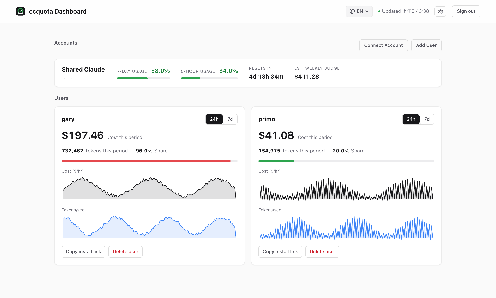
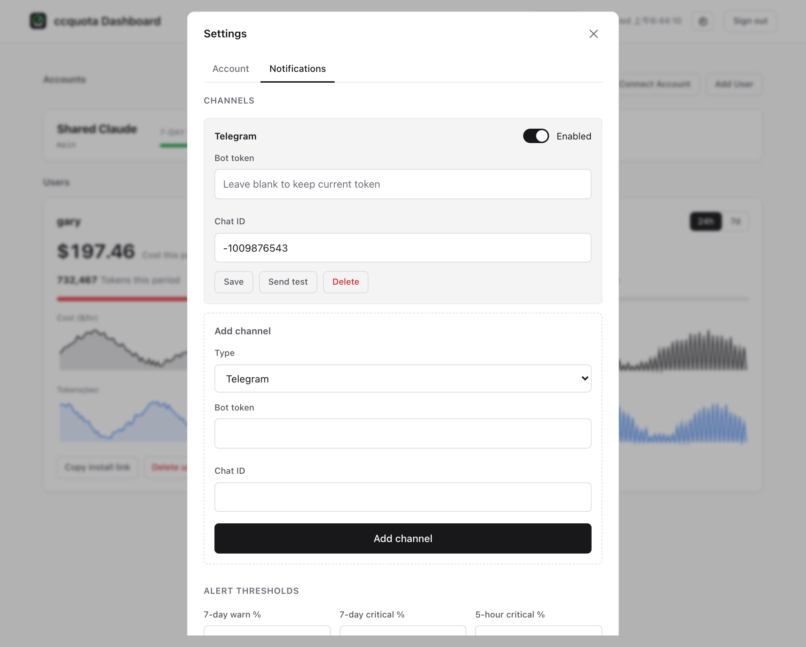

<div align="center">


自架的 Claude 共享账号额度监控。单一 Go binary,内建 web UI。

[](https://github.com/homieyangg/ccquota/releases)
[](https://github.com/homieyangg/ccquota/actions/workflows/ci.yml)
[](LICENSE)

[English](README.md) · [繁體中文](README.zh-TW.md) · **简体中文**

</div>



ccquota 定时打 Claude 官方 OAuth usage endpoint,显示共享账号离 7 天 / 5 小时限流还有多远(可多账号),侦测 Anthropic 的突发重置,并可选择追踪每人花费,反推周额度后平分。

## 功能

- **实时 7d / 5h 使用率**,直接读 OAuth usage endpoint,不靠 log 猜。
- **多账号**,各自排程轮询。
- **per-user 卡片**,每人 cost 与 token 速率图(24h / 7d),鼠标移上去看精确数值。
- **反推周额度**,在账号的人之间平分。
- **突发重置侦测**,Anthropic 提早把窗口归零时会抓到。
- **通知**到 Telegram 或 webhook,门槛在 UI 设定,bot token 加密存。
- **免网页 OAuth**:浏览器贴 code,或导入现有的 `claude login` token。
- 单一 static binary,内嵌 UI,SQLite,不依赖外部服务。

## 快速开始

Linux + systemd 一行装(抓最新 release、设好服务):

```bash
curl -fsSL https://raw.githubusercontent.com/homieyangg/ccquota/main/scripts/install-server.sh | sudo bash
```

或用 Docker:

```bash
docker run -d -p 11451:11451 -v ccquota:/data \
  -e CCQUOTA_ADMIN_PASSWORD=自己取一个 \
  ghcr.io/homieyangg/ccquota
```

或从源码:

```bash
git clone https://github.com/homieyangg/ccquota && cd ccquota
make build && ./ccquota serve
```

开 `http://localhost:11451`。第一次用自动生成的密码登入会要求你改掉。

## 连接账号

dashboard 的 **连接账号** 会带你在浏览器走 OAuth(不用 Claude CLI)。已经 `claude login` 过?直接导入那个 token:

```bash
ccquota set-token --id main --label "Shared Claude"
```

## 新增使用者(每人花费)

每人花费需要设 `CCQUOTA_INGEST_TOKEN`。之后点 **新增使用者**,或在任一使用者卡片按 **复制安装链接**,在每台机器上跑:

```bash
bash <(curl -fsSL -A ccquota-setup https://your-host/e/TOKEN)
```

一条链接可以用在那个人所有的电脑上,用量会合并到同一个名字底下。Client 透过 Claude Code 原生的 OpenTelemetry 上报花费。

## 配置

| 环境变量 | 默认 | 作用 |
| --- | --- | --- |
| `CCQUOTA_ADMIN_PASSWORD` | 自动生成 | 管理员密码。自动生成的值会 log 一次,首次登入须改掉。 |
| `CCQUOTA_DB` | `ccquota.db` | SQLite 文件路径。 |
| `CCQUOTA_INGEST_TOKEN` | 未设 | 开启每人花费上报与安装链接。 |
| `CCQUOTA_PUBLIC_URL` | 自动推导 | 安装链接用的对外网址。 |
| `CCQUOTA_SECRET_KEY` | keyfile | 加密频道密钥用的 base64 32-byte key。未设时会在 DB 旁生成 keyfile。 |
| `CCQUOTA_ENROLL_TTL_DAYS` | `30` | 安装链接有效天数。 |

通知(频道与告警门槛)在 **设定 → 通知** 里设,不走环境变量。



## 开发

```bash
make build      # 编译 binary
go test ./...   # 跑测试
```

前端是 vanilla JS + Alpine.js,用 `go:embed` 内嵌,没有 build step。

## 社区

在 [LINUX DO](https://linux.do) 社区分享,欢迎反馈与 issue。

## 授权

[MIT](LICENSE)
